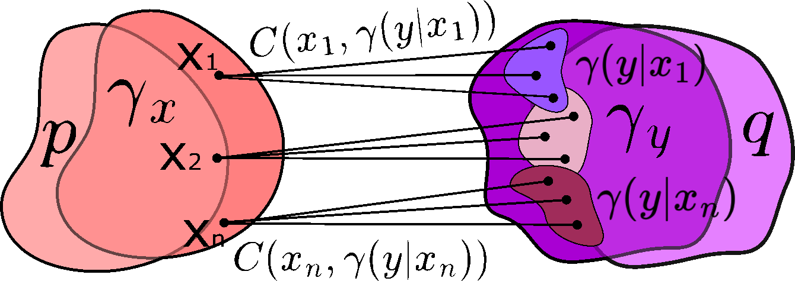
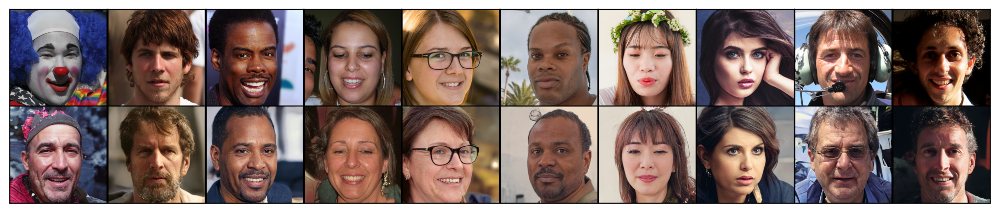

# Light Unbalanced Optimal Transport

This is the official `Python` implementation of the [NeurIPS 2024](https://nips.cc) paper **Light Unbalanced Optimal Transport** (paper [page](https://neurips.cc/virtual/2024/poster/94382) on NeurIPS) by [Milena Gazdieva](https://scholar.google.com/citations?user=h52_Zx8AAAAJ&hl=en), [Arip Asadulaev](https://scholar.google.com/citations?user=wcdrgdYAAAAJ&hl=en&oi=ao), [Evgeny Burnaev](https://scholar.google.ru/citations?user=pCRdcOwAAAAJ&hl=ru) and [Alexander Korotin](https://scholar.google.ru/citations?user=1rIIvjAAAAAJ&hl=en).

The repository contains reproducible `PyTorch` source code for fast, simple, and effective solver which allows solving the continuous **unbalanced entropic optimal transport** (UEOT) problem in minutes on CPU. The algorithm can be used to approximate the **UEOT plans**.

<p align="center"></p>


<!-- ##fast and theretically justified  of **unbalanced entropic optimal transport** (UEOT) **plans** between continuous distributions. Examples are provided for toy problems (2D) and for the unpaired image-to-image translation task for various pairs of datasets.-->

## Presentations
- [Talk](https://www.youtube.com/live/4yURImi4X7k?si=5tiaHtUNTlJmHVaL) by Milena Gazdieva at [AIRI](https://airi.net/ru/) meetup (5 December 2024, RU)
- [Short Talk](https://neurips.cc/virtual/2024/poster/94382) by Milena Gazdieva at [NeurIPS](https://nips.cc) conference website (EN)

## Related repositories
- [Repository](https://github.com/ngushchin/LightSB) for [Light Schrödinger Bridge](https://arxiv.org/abs/2310.01174) paper (ICLR 2024);
- [Repository](https://github.com/podgorskiy/ALAE) for ALAE model.

## Citation
```
@inproceedings{
    gazdieva2024light,
    title={Light Unbalanced Optimal Tansport},
    author={Gazdieva, Milena and Asadulaev, Arip and Burnaev, Evgeny and Korotin, Alexander},
    booktitle={The Thirty-eighth Annual Conference on Neural Information Processing Systems}
    year={2024}
}
```

## Application to Unpaired Image-to-Image Translation Task

A popular testbed which is usually considered in OT/EOT papers is the unpaired image-to-image translation task. However, the usage of the balanced OT/EOT solvers in these tasks lead to failures in certain cases, e.g., when the attributes of objects from source and target distributions are not balanced or the distributions are contaminated with outliers.

This problem could be alleviated by using our **unbalanced** EOT solver. Our method offers a parameter $\tau\in \mathbb{R}_+$ which controls the level of unbalancedness of the learned plans. For small $\tau$, our solver truly learns the UEOT plans, while for large $\tau$, its results are close to those of balanced solvers. In contrast to other existing UEOT solvers, our ULightOT solver is **fast**, **light** and **theoretically justified**. 

<!-- It can be used to get approximations of UEOT plans with minimal transport cost (quadratic).  -->

<!-- We consider subsets of FFHQ dataset (*Adult, Young, Man, Woman*) and test our solver with different parameters $\tau$ in all variants of translations between them. The main challenge of the described translations is the *imbalance of classes* in the images from source and target subsets which can be succesfully mitigated by using our solver.  -->

**An example**: unpaired *Adult*$\rightarrow$*Young* translation by our ULightOT solver ($\tau=100$) applied in the latent space of ALAE for 1024x1024 FFHQ images. Our ULightOT solver converges in several minutes on 4 cpu cores and is robust to the imbalance of *gender* classes in source and target distributions. 

<p align="center"></p>


## Repository structure

The implementation is CPU-based and tested with `torch==2.0.0`.

The experiments are issued in the form of pretty self-explanatory jupyter notebooks (`notebooks/`). For convenience, the majority of the evaluation output is preserved. Auxilary source code is moved to `.py` modules (`src/`). The code for launching ALAE model is located in `ALAE/` folder. Checkpoints for classifies used to evaluate the performance of our solver in the unpaired image translation problem are moved to `checkpoints/` folder.
- ```notebooks/ULightOT_gaussians.ipynb``` - experiment with *Gaussian mixtures* in 2D (demonstrates the ability of our solver to deal with *class imbalance* issue);
- ```notebooks/ULightOT_gaussians_outliers.ipynb``` - experiment with *Gaussian mixtures* with added outliers in 2D (demonstrates the ability of our solver to simultaneously hadle the *class imbalance* and *outliers* issues);
- ```notebooks/ULightOT_alae.ipynb``` - experiment with unpaired image-to-image translation using the latent space of ALAE autoencoder.


<!-- ## Datasets
- [Aligned anime faces](https://www.kaggle.com/datasets/reitanaka/alignedanimefaces) (105GB) should be pre-processed with ```datasets/preprocess.ipynb```;
- [CelebA faces](https://mmlab.ie.cuhk.edu.hk/projects/CelebA.html) requires ```datasets/list_attr_celeba.ipynb```;
- Handbags, shoes [datasets](https://github.com/junyanz/iGAN/blob/master/train_dcgan/README.md);
- [Describable Textures Dataset](https://www.robots.ox.ac.uk/~vgg/data/dtd/) (DTD);
- [Flickr-Faces-HQ Dataset](https://github.com/NVlabs/ffhq-dataset/blob/master/README.md) (FFHQ);
- [Comic faces](https://www.kaggle.com/datasets/defileroff/comic-faces-paired-synthetic);
- [Bonn Furniture Styles Dataset](https://cvml.comp.nus.edu.sg/furniture/).

The dataloaders can be created by ```load_dataset``` function from ```src/tools.py```. The latter four datasets get loaded directly to RAM. -->

## Credits
- [Weights & Biases](https://wandb.ai) developer tools for machine learning;
- [pytorch-fid repo](https://github.com/mseitzer/pytorch-fid) to compute [FID](https://arxiv.org/abs/1706.08500) score;
- [Inkscape](https://inkscape.org/) for the awesome editor for vector graphics.
